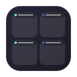
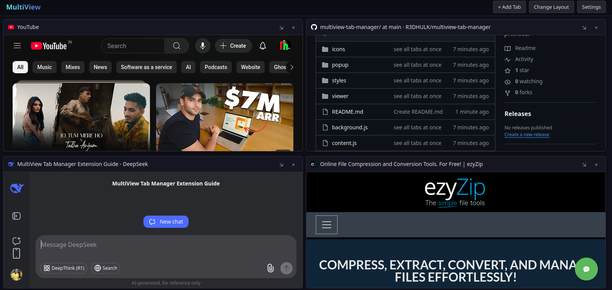

# MultiView - Tab Manager

MultiView is a powerful browser extension that lets you arrange and view multiple tabs side by side with a beautiful glassmorphism design. Perfect for productivity, research, and multitasking!

## Features ✨

- **Multiple Layouts**: Choose from Grid, Horizontal, or Vertical layouts
- **Stylish Themes**: Dark/Light Glassmorphism and Solid themes
- **Customizable UI**: Adjust blur amount and panel opacity
- **Drag & Drop**: Easily rearrange panels
- **Resizable Panels**: Customize each panel's size
- **Context Menu Integration**: Add tabs to MultiView with right-click
- **Responsive Design**: Works on all screen sizes

## Installation 🚀

### Chrome/Edge
1. Download this repository
2. Go to `chrome://extensions/` or `edge://extensions/`
3. Enable "Developer mode"
4. Click "Load unpacked" and select the extension folder

### Firefox
1. Download this repository
2. Go to `about:debugging#/runtime/this-firefox`
3. Click "Load Temporary Add-on"
4. Select any file in the extension folder

## How to Use 📖

1. Click the MultiView icon in your toolbar
2. Select tabs you want to view simultaneously
3. Choose your preferred layout
4. Click "Create MultiView"
5. Enjoy your multi-tab workspace!

**Pro Tip**: Right-click any tab and select "Add to MultiView" for quick access!

## Customization 🎨

Adjust these settings to personalize your experience:
- **Theme**: Dark Glass (default), Light Glass, Dark Solid, Light Solid
- **Blur Amount**: From 0px (no blur) to 20px (heavy blur)
- **Opacity**: Control panel transparency (30%-100%)
- **Layout**: Grid, Horizontal, or Vertical arrangements

## Technical Details ⚙️

- **Manifest Version**: 2
- **Permissions**: 
  - `tabs` - To access and manage browser tabs
  - `storage` - To save user preferences
  - `contextMenus` - For right-click integration
  - `webRequest` - To handle frame restrictions

## Troubleshooting 🔧

If a website won't display in MultiView:
1. Click the "Open in New Tab" button in the panel
2. Some sites block being embedded in iframes for security

## Contributing 🤝

We welcome contributions! Please:
1. Fork the repository
2. Create a feature branch
3. Submit a pull request

## License 📜

This project is licensed under the MIT License - see the [LICENSE](LICENSE) file for details.

## Screenshots 📷

*Dark Glass Theme with Grid Layout*

---

Enjoy your new productivity powerhouse! ⚡  
For support or feature requests, please open an issue.
